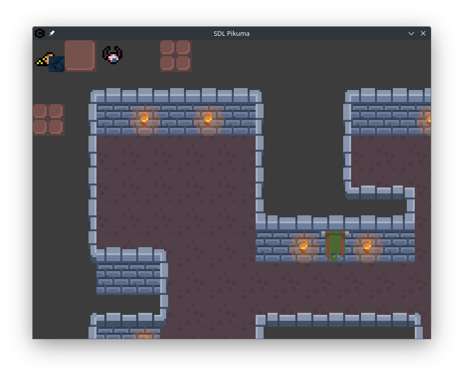

## SDL_Game_00

### Nota:

> Aun esta en proceso.

### Objetivo

* Un engine 2D en C++23 usando ECS en SDL2.
* Aun no se, si va a hacer "platformer" o "topdown".
* La idea en general es "Subir de nivel".

### En proceso

- [x] Logger
- [x] Tile map
    - Nota: Hecho con la herramienta Tiled (Json)
    - [x] Mostart tiles
    - [x] Mostart tiles animados
    - [x] Deserializar Objetos
    - [x] Deserializar Collisiones
- [ ] GameStates
    - [ ] MainMenu
    - [ ] Game
    - [ ] Pause
- [ ] Camara
- [ ] Personajes
    - [ ] Player
    - [ ] Enemies

...

### Ideas

- Me gustaría implementar algo similar a libgdx con los screens